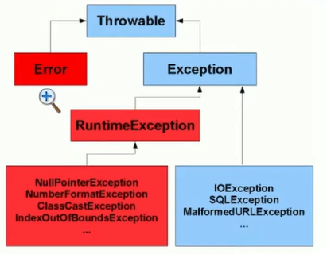
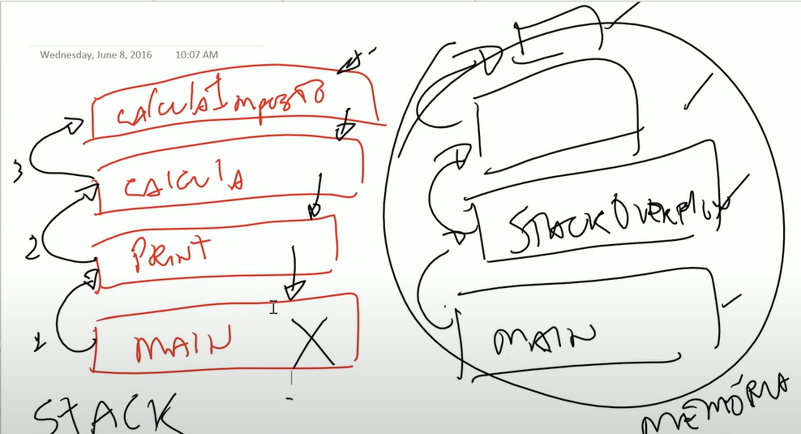

<h1 align="center">Exceptions</h1>

<h3 align="center"> Canal do YouTube: <a href="https://www.youtube.com/watch?v=MO12vFGPbxo&list=PL62G310vn6nHrMr1tFLNOYP_c73m6nAzL&index=68">DevDojo</a> </h3>

> Curso Java Completo - Aula 67: Exceptions pt 01

**`Exceptions`**

- Fluxos que não seguem o caminho que deveriam ser seguidos, pode estar previsto ou não no código, foi criado para tratar todos os imprevistos que podem acontecer;
- São classes e todas elas são filhas da classe **`Throwable`** - significa todas as exceções que podem ser lançadas;
- Quando ocorre alguma exceção no Java dizemos que aquele método lançou uma exceção;

> </br>

**`Error`** -> exceções elas podem ser tratadas, tem como contornar e prevenir porem quando esta trabalhando com error
não precisa criar tratamentos porque simplesmente vão afetar de uma forma a execução do programa;

```
package Oexception;

public class ErrorTest {

	public static void main(String[] args) {
		// TODO Auto-generated method stub
		stackOverflowError();
	}

	public static void stackOverflowError() {
		stackOverflowError();
	}
}
 SAÍDA: Exception in thread "main" java.lang.StackOverflowError
```

- Criando erro -> quando chamar o método satckOverflowError() ele vai se chamar, fazendo isso até ter um erro; **`stack`** é o empilhamento da chamada dos objetos em memória;

> Como funciona a chamada de métodos no Java:

- Do método main chamo o método print, dentro do método print tem uma chamada para o método calcula e dentro do método calcula tem uma chamada para calculaImposto, esta montando uma pilha que chama de `stack`;

- Quando tem o método em cima da pilha calculaImposto, caso esse método lançar uma exceção e essa exceção não for tratada, ele vai jogar para o método calcula se o calcula tambem não tratar vai jogar para o print se o print tambem não fizer nenhum tipo de tratamento vai jogar para o main e se o main não fizer nenhum tratamento o programa vai parar de executar;

- Quando tem um **`stackOverflowError`** -> significa que essa pilha estourou o espaço disponível na memória;

> </br>

> Curso Java Completo - Aula 68: Exceptions pt 02

**`Exceptions`**

`Checked`(Checado) -> sempre que a exceção for do tipo checked vai ser obrigado a criar algum tipo de tratamento para aquela exceção; o compilador já está esperando que crie um tratamento antes mesmo de executar um programa; são exceções que estão além do domínio controle do programador;
`Ex.:` -> Uma conexão com o banco de dados remotos simplesmente não está mais funcionando apesar do código estar corretamente;

`Unchecked`(Não Checado) -> são exeções que não precisam criar nenhum tipo de tratamento para seu código compilar, geralmente a maioria das exeções são erros de lógica; erros do programador; `Ex.:` -> caso tente acessar uma posição no array essa posição não existe então isso é um problema de lógica de programação;

**`RuntimeException`** -> filhas de `RuntimeException` são consideradas `Unchecked`;

**`Exception`** -> todas que são filhas de `Exceptions` são do tipo `Checked`;
`Ex.:` `IOException` -> caso tente abrir um arquivo e esse arquivo não exista é uma exceção que deve tratar; quando vai tentar abrir um arquivo já tem que criar um tratamento para caso esse arquivo não exista; `SQLException` -> quando esta criando uma conexão com banco de dados é obrigado a criar um tratamento para caso essa conexão não consiga ser obtida; 

`ArithmeticException` -> é quando tenta fazer uma condição aritmética que não é permitida `Ex.:` um inteiro dividido por 0;
````
package Oexception;

public class RunTimeExceptioTest {
	public static void main(String[] args) {
		int a = 10/0;
		System.out.println(a);
	}
}	

	SAÍDA: Exception in thread "main" java.lang.ArithmeticException: / by zero
	at Exceptions/Oexception.RunTimeExceptioTest.main(RunTimeExceptioTest.java:5)
````
- `RuntimeException` teve um erro em tempo de execução, colocamos o 0 mas poderia ter pegado esse 0 do banco de dados ou algum usuário ter digitado 0; é um erro em tempo de execução por não foi tratado;
- Erros em tempo de execução geralmente são erros causados pela lógica do programador;
````
package Oexception;

public class RunTimeExceptioTest {
	public static void main(String[] args) {
		int a = 10;
		int b = 0;
		if (b != 0) {
			int c = a / b;
			System.out.println(c);
		}

	}
}
````
> https://docs.oracle.com/javase/8/docs/api/java/lang/ArithmeticException.html


`NullPointerException` -> erro em tempo de execução e ele acontece quando tenta acessar um método através de uma variável de referencia em que essa variavel de referencia não tem nenhum objeto em memória sendo referenciado; 
- A classe `Object` tem vários métodos para poder utilizar;
- A variavel de referencia nunca vai executar um método, quem vai executar um método é sempre um objeto;
- `Ex.:` caso eu tente chamar um método de uma variavel de referencia que nao tem nenhum objeto sendo referenciado por ela;
````
		Object o = null;
		System.out.println(o.toString());
````


> https://docs.oracle.com/javase/8/docs/api/java/lang/NullPointerException.html