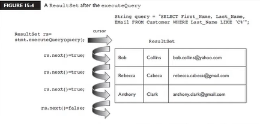
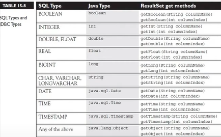

<h1 align="center">JDBC2</h1>

<h3 align="center"> Canal do YouTube: <a href="https://www.youtube.com/watch?v=bqhgKj5rxDU&list=PL62G310vn6nHrMr1tFLNOYP_c73m6nAzL&index=146">DevDojo</a> </h3>

> Curso Java Completo - Aula 145: JDBC pt 06 ResultSet pt 01 - Selecionando registros

- `ResultsSet` - quando executa uma `Query` você está retornando um `ResultsSet`- ele vai retornar o que aquela consulta obteve, primeiramente quando executa algum tipo de registro o cursor ele não vai apontar o primeiro registro, vai apontar para antes do primeiro registro e vai precisar utilizar o `next` para andar até que o next retorne false e sai do laço;

- Os dados que nós pegamos são representados pelos tipos de Java;

- O INDICE NO RESULTSSET SEMPRE COMEÇA COM 1 DIFERENTE DE ARRAYS, LISTAS; 

## �� Tecnologias

  

          

