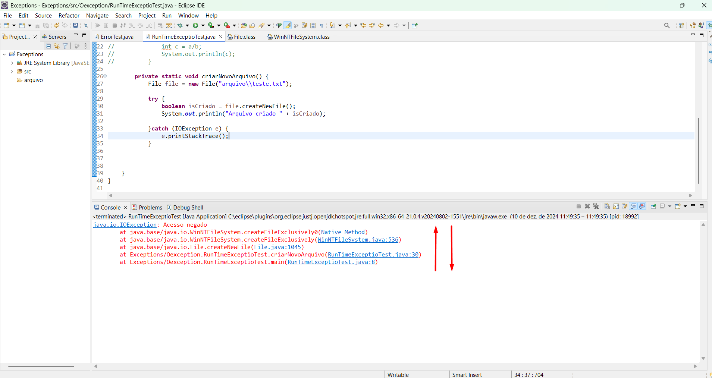

# Exception

No exemplo esta fazendo uma tratativa para o arquivo que esta sendo criado de uma exceção, `e.printStackTrace`-> imprimi tudo o que aconteceu na stack para tentar identificar mas o programa não vai simplesmente parar de funcionar porque fez uma tratativa; ele retorna `void` então não pode colocar dentro de um `syso`; **Lógica de negócio não deve colocar dentro do `catch`**;
````
package Oexception;

import java.io.File;
import java.io.IOException;

public class RunTimeExceptioTest {
	public static void main(String[] args) {
		criarNovoArquivo();
		
	}	
		private static void criarNovoArquivo() {
			File file = new File("arquivo\\teste.txt");
			
			try {
				boolean isCriado = file.createNewFile();
				System.out.println("Arquivo criado " + isCriado);
				
			}catch (IOException e) {
				e.printStackTrace();
			}	
	}
}
````
Para simular o erro alterei as permissões de segurança na pasta arquivo;
- Tento criar no `Método Nativo`, ai o `createNewFile` dentro da classe `File` lanço aquela exceção:
 
