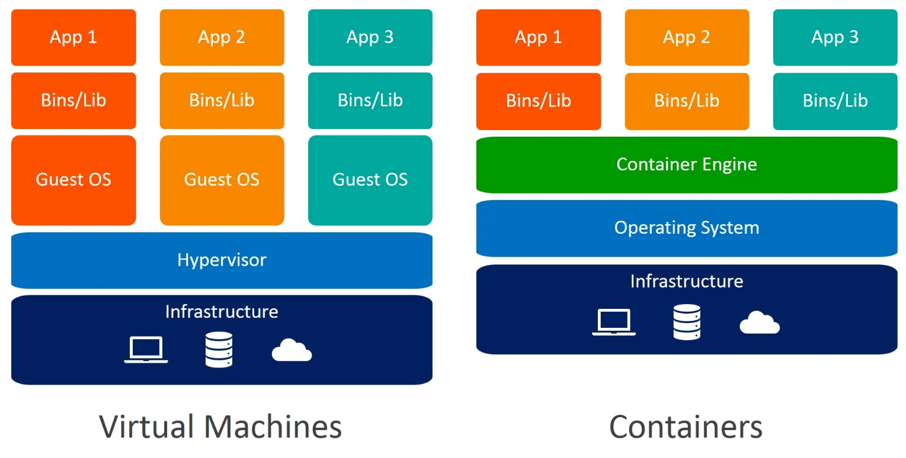

# JDBC

`Docker` - facilita a utilização de diversos tipos sistemas, não só de bancos de dados; é uma forma mais leve de máquinas virtuais; 

- **Vitual Box**: `infrastructure` -> os componentes do computador(memória RAM, processador); `Hypervisor` -> que possibilita a utilizar máquinas virtuais e quando tem máquinas virtuais tradicionais tem que instalar o sistema operacional `Guest OS` para cada máquina virtual instalada precisa instalar um SO em cima do seu SO, não é uma aplicação leve, uma aplicação pesada que precisa de muito recursos então o `docker` veio para solucionar esse problema;

- **Docker** ao invés de ter o `Hypervisor` e o `Guest OS` tem o `Docker Engine` que é basicamente uma aplicação que vai ao invés de voce precisar de um sistema operacional completamente novo ele vai ajudar voce a reutilizar algumas bibliotecas, algumas funcionalidades do SO existente, ai roda o que chamamos de `containers`; 

https://docs.docker.com/desktop/setup/install/windows-install/